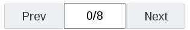

# Suite DX tutorial for Web-Developers

## 1. Prepare Workspace

Things we do to prepare was described in the [Intro Tutorial](player-sdk-intro.md)

- create `index.html` and directory `presentation`
- convert your presentation
- copy converted content into `presentation` directory
- put the following code to `index.html`:

```html
<!DOCTYPE html>
<html>
  <head>
    <meta charset="utf-8">
    <meta name="viewport" content="width=device-width,initial-scale=1,maximum-scale=1"/>
    <title>Insert your title here</title>
    <style>
        #presentation {
            width: 864px;
            height: 540px;
            border: 1px solid #000;
        }
    </style>
  </head>
  <body>
    <div>
      <iframe id="presentation" src="presentation/index.html"></iframe>
    </div>
    <script>
        var ispringPresentationConnector = {};

        ispringPresentationConnector.register = function(player)
        {
            // TODO: add navigation panel
        };
    </script>
  </body>
</html>
```

## 2. Next/Prev buttons

Now we can add two buttons to control navigation.

#### New CSS

```css
#button-prev, #button-next {
    float: left;
    display: inline-block;
    width: 80px;
    height: 35px;
}
```
#### New HTML
```html
<div class="clear"> </div>
<div>
  <button id="button-prev">Prev</button>
  <button id="button-next">Next</button>
</div>
```
#### Whole Javascript
```js
var ispringPresentationConnector = {};

ispringPresentationConnector.register = function(player) {
    var playbackController = player.view().playbackController();
    initPlaybackControls(playbackController);
};

function initPlaybackControls(playbackController) {
    var prevBtn = document.getElementById("button-prev");
    prevBtn.onclick = function() {
        playbackController.gotoPreviousSlide();
    };

    var nextBtn = document.getElementById("button-next");
    nextBtn.onclick = function() {
        playbackController.gotoNextSlide();
    };
}
```

## 3. Current Slide Indicator

Let's add indicator with current slide number between Next and Prev buttons:



#### Changes in HTML

```diff
<body>
  <div class="buttons">
    <button id="button-prev">Prev</button>
+    <div id="slide-counter">
+        <p id="current-slide"></p>
+    </div>
    <button id="button-next">Next</button>
  </div>
</body>
```
#### Customizing with CSS
```css
#slide-counter {
    float: left;
    text-align: center;
    min-width: 80px;
    border: 1px solid #000;
    vertical-align: bottom;
    display: inline-block;
    height: 33px;
}
#current-slide {
    margin-top: 7px;
    border: none;
    width: 100%;
}
```
#### Changes in Javascript
```diff
var ispringPresentationConnector = {};

ispringPresentationConnector.register = function(player) {
+    var presentation = player.presentation();
    var playbackController = player.view().playbackController();
+    var slidesCount = presentation.slides().count();
+    initPlaybackControls(playbackController, slidesCount);
};

-function initPlaybackControls(playbackController) {
+function initPlaybackControls(playbackController, slidesCount) {
    var prevBtn = document.getElementById("button-prev");
    prevBtn.onclick = function() {
        playbackController.gotoPreviousSlide();
    };

    var nextBtn = document.getElementById("button-next");
    nextBtn.onclick = function() {
        playbackController.gotoNextSlide();
    };

+    var slideNoLabel = document.getElementById("current-slide");
+    playbackController.slideChangeEvent().addHandler(function(slideIndex)
+    {
+        slideNoLabel.innerHTML = (slideIndex + 1).toString() + "/" + slidesCount;
+    });
}
```

## 4. Selecting Slide by Number

Right now we have indicator which shows current slide number. It will be useful to add abilty for changing slide by entering it's number.

#### Changes in HTML
```diff
-        <p id="current-slide"></p>
+        <input id="current-slide" type="text" size="3">
+        <span>/</span>
+        <span id="slide-count">0</span>
```

#### Changes in CSS
```diff
#current-slide {
-    border: none;
-    width: 100%;
+    border: 1px solid #8AD;
+    width: 35%;
}
```

#### Remove the following Javascript:
```diff
-    var slideNoLabel = document.getElementById("current-slide");
-    playbackController.slideChangeEvent().addHandler(function(slideIndex)
-    {
-        slideNoLabel.innerHTML = (slideIndex + 1).toString() + "/" + slidesCount;
-    });
```
#### Replace it with:
```js
    var slideCountLabel = document.getElementById("slide-count");
    slideCountLabel.innerHTML = slidesCount.toString();
    var slideNoInput = document.getElementById("current-slide");
    playbackController.slideChangeEvent().addHandler(function(slideIndex)
    {
        slideNoInput.value = (slideIndex + 1).toString();
    });
    slideNoInput.onchange = function()
    {
        var currentSlideIndex = playbackController.currentSlideIndex();
        var nextSlideIndex = parseInt(slideNoInput.value) - 1;
        if (nextSlideIndex >= 0 && nextSlideIndex < slidesCount)
        {
            playbackController.gotoSlide(nextSlideIndex);
        }
        else
        {
            slideNoInput.value = (currentSlideIndex + 1).toString();
        }
    };
```

