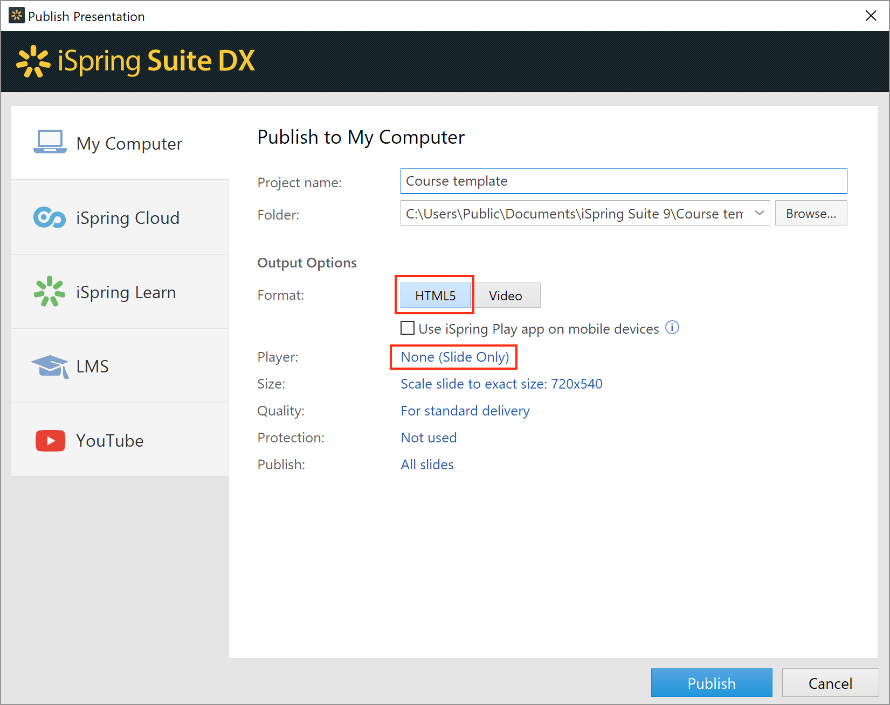
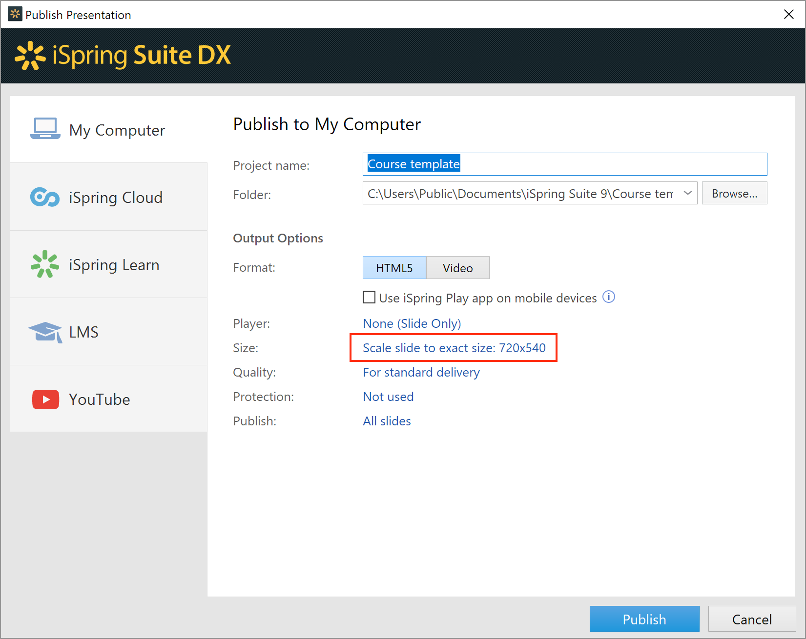
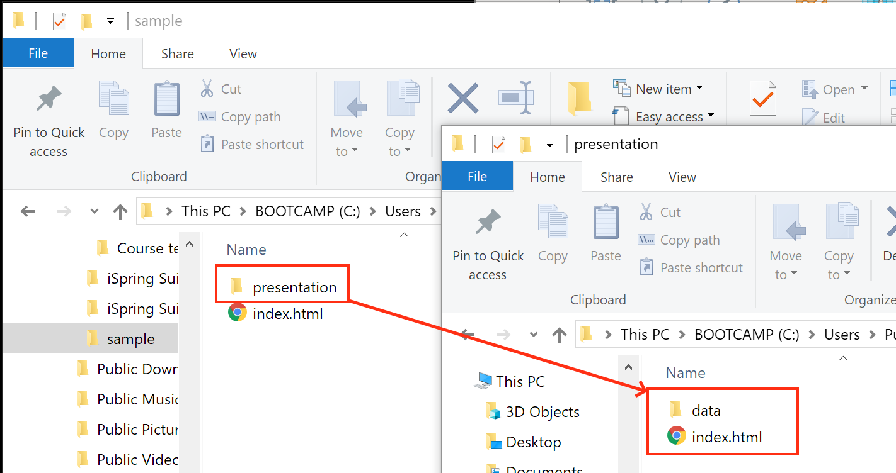

# Suite DX tutorial for Web-Developers

### 1. HTML page

Let's create simpliest HTML page placeholder, and save it as "index.html"

```html
<!DOCTYPE html>
<html>
  <head>
    <meta charset="utf-8">
    <meta name="viewport" content="width=device-width,initial-scale=1,maximum-scale=1"/>
    <title>Insert your title here</title>
  </head>
  <body>
    <h2>Here will be your presentation</h2>
    <!-- Presentation placeholder -->
  </body>
</html>
```

### 2. Publish Presentation

Now, let's convert our presentation using [iSpring Suite DX](http://www.ispringsolutions.com/ispring-suitedx).
For this tutorial, we will use

- Combined (Flash+HTML5) conversion mode
- "None" player that means "player with no skin"



- Check that option "Enable presentation control API" turned on at "Advanced" tab
- You can choose custom presentation container size, e.g. 864x540 pixels




Let's publish! After that
- create directory "presentation" along with your "index.html" file
- copy converted presentation into this folder



### 3. Embed Presentation

Now, we should embed presentation into ```<iframe>``` tag.
```diff
<!DOCTYPE html>
<html>
  <head>
    <meta charset="utf-8">
    <meta name="viewport" content="width=device-width,initial-scale=1,maximum-scale=1"/>
    <title>Insert your title here</title>
+    <style>
+        #presentation {
+            float: left;
+            width: 864px;
+            height: 540px;
+            border: 1px solid #000;
+        }
+     </style>
  </head>
  <body>
-    <h2>Here will be your presentation</h2>
-    <!-- Presentation placeholder -->
+    <div>
+      <iframe id="presentation" src="presentation/index.html"></iframe>
+    </div>
  </body>
</html>
```

### 4. Connect to Player

- add new textfield which will be changed on presentation player start
- add javascript code below to animate it

```diff
<!DOCTYPE html>
<html>
  <head>
    <meta charset="utf-8">
    <meta name="viewport" content="width=device-width,initial-scale=1,maximum-scale=1"/>
    <title>Insert your title here</title>
    <style>
        #presentation {
            width: 864px;
            height: 540px;
            border: 1px solid #000;
        }
+
+        #state-indicator {
+            float: left;
+            font: 18px 'Arial', sans-serif;
+            margin-left: 50px;
+        }
    </style>
  </head>
  <body>
    <div>
      <iframe id="presentation" src="presentation/index.html"></iframe>
    </div>
+    <p id="state-indicator">Presentation is not running yet</p>
+    <script>
+        var ispringPresentationConnector = {};
+
+        ispringPresentationConnector.register = function(player)
+        {
+            var indicator = document.getElementById("state-indicator");
+            indicator.innerHTML = "Presentation is running";
+        };
    </script>
  </body>
</html>
```

### Read Next

- [HOWTO add navigation panel and outline](player-navigation-panel.md)

